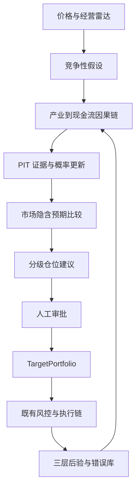

# ADR-0003：主观基本面策略作为一等研究与组合引擎

- 状态：Accepted
- 日期：2026-07-22

## 决策

AQuant 将“证据驱动的主观基本面投资”作为与系统化多因子并列的核心策略，而不是把主观
判断写成量化模型之外的临时备注。策略标识为 `discretionary-fundamental-v1`，完整链路为：

## 不变量

1. 价格是研究报警器，不是买入结论；价格证据单独存在时不得形成仓位。
2. 每个正式研究案必须同时保留基本面、资金/技术、噪声三类竞争性解释及反证条件。
3. 每个研究案必须建立“产业变化→客户行为→公司订单→收入→利润率→现金流→股东回报”
   的完整因果链，并明确三个关键变量。
4. 所有证据保存发生、发布、采集、可用时间；决策只能读取 `available_at <= asof_time`。
5. 原始证据不可覆盖。修订必须新增记录并指向被替代版本。
6. 实时估计与事后平滑估计永久分离；`RETROSPECTIVE` 版本不得生成仓位建议。
7. 同一依赖簇内的转载、上下游转述或重复采样不得重复增加概率。
8. 后验校准分为测量误差、经营到利润的传导误差、认知差到收益的投资误差；股价收益
   不得直接作为非标数据真伪的唯一标签。
9. 加仓只能来自经营证据升级。上涨不是加仓依据，下跌也不自动构成补仓依据。
10. 策略只生成待审批的仓位建议；人工确认后才能生成 `TargetPortfolio`。自由文本模型、
    LLM 或研究界面不得直接生成券商订单。
11. 执行仍遵循既有 `TargetPortfolio → RebalancePlanner → OrderIntent → PreTradeRisk →
    ExecutionAgent` 边界。
12. 只允许公开信息、合法授权数据与合规调研信息进入证据库。

## 原因

主观投资的可复制优势不是一次性的“看对公司”，而是持续把价格异常转化为可证伪假设，
把非标信息转化为可校准传感器，把认知差转化为受控仓位，再把结果转化为下一轮更好的
先验。现有 AQuant 的 PIT、数据版本、审计、组合和执行隔离能力正好可以治理这一过程。

## 后果

- 研究录入成本上升，但每次判断都可以回放、归因和校准；
- 非标数据不承诺绝对准确，重点转为固定口径、误差可估计和持续后验；
- 早期历史回测受限，无法取得真实历史版本的数据只能从当前时点向前积累；
- 组合容量与风险预算继续服从全局限制，主观判断不构成绕过风控的理由；
- 自动化负责发现、整理、提醒、计算和审计，最终投资判断与生产审批保留在人。

