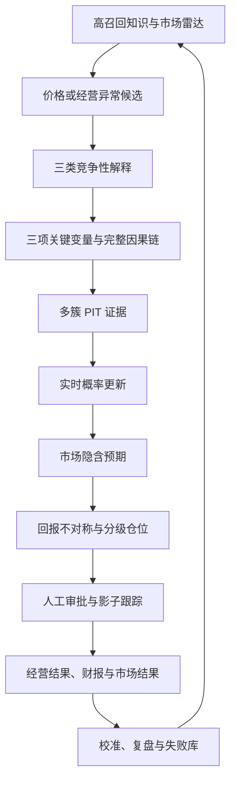

# AQuant 主观基本面投资策略

## 1. 战略定位

主观基本面策略是 AQuant 的核心投资引擎之一，与量化多因子策略并列，而不是量化策略的
临时补丁。量化系统负责大范围发现统计异常，主观系统负责解释异常背后的经营变化，组合
系统负责在仍可能判断错误时决定承担多少风险。

这套策略追求的优势是：

> 比市场更早建立因果链，比市场更快更新证据，比市场更准确识别价格中的预期，并在仍然
> 可能犯错的情况下正确管理仓位。

它每天必须回答三个问题：

1. 我们现在知道什么？
2. 市场现在相信什么？
3. 下一条真正能够改变判断的证据是什么？

策略不把“好公司”等同于“好股票”。只有当我们的概率分布与价格隐含概率之间存在重大、
可验证且具有正向回报不对称性的差异时，才可能形成仓位。

## 2. 完整研究漏斗



### 2.1 高召回知识入口

漏斗顶层优先保证敏感度和覆盖面，不因来源“看起来不专业”而提前丢弃潜在线索。入口覆盖：

- 学术论文、卖方研报与产业报告；
- GitHub 工具、开源数据集和可复现代码；
- 法律、监管、交易制度与产业政策；
- 私募、个人投资者和产业专家的可验证经验；
- 海外市场可以迁移到 A 股的研究；
- 另类数据、公开经营活动和上下游拼图；
- 失败策略、错误判断、错过与卖飞案例。

入口高召回不代表直接采纳。每个候选遵循：

```text
DISCOVERED → REPRODUCED → VALIDATED → SHADOW → APPROVED → PRODUCTION
                         ↘ REJECTED / FAILURE LIBRARY
```

`src/aquant/knowledge/lifecycle.py` 固化了这条状态机。进入 `APPROVED` 必须有人类审批者，
进入生产前必须保留可复现实验证据哈希。

### 2.2 价格与经营异常雷达

价格是全市场信息的压缩结果，往往先于研究员，但价格只触发研究。优先扫描：

- 连续数周跑赢行业，而非单日大涨；
- 大盘或行业下跌时表现稳定；
- 行业内少数公司率先走强；
- 放量突破后没有快速回落；
- 利空落地后跌不动；
- 财报表面一般但价格反应异常强；
- 盈利预测尚未上调，价格和成交结构已经改变；
- 上游、设备、零部件沿产业传导顺序依次走强。

量化雷达应尽量解释市场、行业、规模、Beta、风格和已知事件，仅把残差异常送入研究池。
核心提问不是“为什么涨”，而是：

> 市场是否正在交易一个尚未进入我们模型的新变量？

### 2.3 三类竞争性解释

每个正式研究案必须同时建立三类假设：

| 类型 | 典型解释 | 必须写出的反证 |
| --- | --- | --- |
| 基本面变化 | 需求、份额、价格、产品周期、利润率变化 | 哪条经营事实会推翻它 |
| 资金/技术结构 | 被动资金、主题轮动、筹码集中、逼空 | 资金退潮后应出现什么 |
| 噪声 | 传闻、情绪、操纵、偶然波动 | 多久未兑现即判为噪声 |

禁止只搜索最乐观的解释。`ResearchCase` 要求三类假设的先验概率合计为 1，且每类都有明确
反证条件。后续每条证据必须同时给出对所有竞争假设的似然比。

### 2.4 完整因果链

正式研究不是增加新闻数量，而是缩小下面各环节的不确定性：

\[
产业变化 \rightarrow 客户行为 \rightarrow 公司订单 \rightarrow 收入
\rightarrow 利润率 \rightarrow 现金流 \rightarrow 股东回报
\]

每一环都必须记录：

- 当前已知事实；
- 仍然未知的变量；
- 可观察的领先指标；
- 下一次验证日期；
- 能够推翻该环节的事实。

研究案必须选择恰好三个决定公司价值的关键变量。每个变量至少有两个领先指标，每个领先
指标至少连接两个相互独立的来源簇。这样做的目的不是机械凑数，而是阻止单一信息源制造
虚假的确定性。

## 3. 行业专属信息时钟

不建设一个“包打天下”的另类数据总分。先为商业模式定义经营时钟：

| 公司类型 | 重点领先信息 |
| --- | --- |
| 消费品牌 | 同店、客单价、复购、正价率、渠道质量、新店爬坡 |
| 半导体/硬件 | 客户 Capex、认证、设备采购、产能利用率、库存、交期 |
| 软件/SaaS | 新增客户、续费、席位数、招聘、云市场排名 |
| 医药 | 临床进度、入组速度、医院准入、招采、处方放量 |
| 工程机械 | 开工率、设备利用小时、更新周期、出口、经销商库存 |
| 化工周期 | 价差、库存、开工率、检修、扩产、进口量 |
| 新能源 | 排产、招标、装机、库存、产业链价格、技术路线 |
| 资源品 | 港口库存、运价、发运量、品位、成本曲线 |
| 连锁零售 | 同店、新店爬坡、闭店率、单店模型、租金、人效 |

信息优先级按与经营事实的因果距离排序：真实交易/客户行为，客户与供应商披露，生产与
产能行为，产品和技术进展，管理层高成本行为，最后才是价格和交易结构。

## 4. 非标证据的数据协议

### 4.1 把数据源视为有偏传感器

真实经营状态通常不可直接观察。对来源 \(j\) 的观测：

\[
z_{j,t}=\alpha_j+\beta_j x_t+\varepsilon_{j,t}
\]

单次观测可以不准，只要采集口径稳定、偏差可估计、结果可验证，就能成为领先指标。固定
高报的温度计可以校准；每次以不同方式测量且误差方向随机的数据不能进入核心证据。

### 4.2 每条证据的最小元数据

`EvidenceObservation` 强制保存：

- 研究案、关键变量和来源 ID；
- 原始 URI 与内容 SHA-256；
- 来源类型、依赖簇和合规取得方式；
- 方法版本和固定采样定义；
- 发生、发布、采集、可用四个时间；
- 对每个竞争假设的似然比；
- 因果接近度、可靠性、独立性、时效性和预期差；
- 领先、经营确认或财务确认的成熟度；
- 验证的是需求、份额、盈利能力、现金流还是其他变量；
- 是否已经触发基本面假设的明确反证。

信息权重遵循：

\[
信息价值=
因果接近度\times可靠性\times独立性\times时效性\times预期差
\]

所有维度都在 0 到 1 之间。刺激但不可验证的信息只能作为线索，不能用“独家”替代可靠性。

### 4.3 固定口径优先于绝对精度

非标数据优先预测方向、拐点和相对强弱，不直接宣称精确收入金额。以门店样本为例：固定
城市、门店、时段、客流/成交/缺货定义，并始终保留竞品对照；使用同比、环比和相对竞品
变化，而不是把有限样本外推成全国绝对客流。

### 4.4 PIT 与双版本

决策只能读取：

```text
evidence.available_at <= decision.asof_time
calibration.outcome_available_at <= decision.asof_time
```

每个判断保留两个版本：

- `REAL_TIME`：当时实际可得信息形成的判断，可进入回测、影子盘和仓位建议；
- `RETROSPECTIVE`：加入后来财报后的最佳解释，只用于误差研究和训练下一期模型。

事后结果只能调整未来来源权重，不能覆盖历史证据，也不能把平滑结果伪装成当时已知。

### 4.5 依赖簇去重

招聘、供应商转述和行业媒体可能都来自同一轮扩产。证据按客户需求、公司生产、供应链
交付、渠道成交、官方披露、价格资金等依赖簇分组。同一簇内对数似然取质量加权平均，
不同簇才可以相乘，避免转载十次被当成十条独立证据。

## 5. 概率更新与证据阶段

对假设 \(H_k\) 和证据簇 \(c\)：

\[
P(H_k\mid E)\propto P(H_k)\prod_c LR_{c,k}
\]

`BayesianBeliefEngine` 只使用截至决策时间可见的证据，并在依赖簇内先去重。模型输出概率
是决策语言，不是假装精确知道未来；似然比和先验都必须接受后验校准。

证据阶段与允许仓位：

| 阶段 | 最低要求 | 仓位权限 |
| --- | --- | ---: |
| RADAR/HYPOTHESIS | 只有价格或未校准线索 | 0 |
| WATCHLIST | 至少一个非价格来源簇 | 0 |
| OBSERVATION | 至少两个独立非价格簇，预期差与期望收益为正 | ≤0.5% |
| EVIDENCE | 经营或财务结果开始确认 | ≤2% |
| CORE | 需求、份额、盈利、现金流跨簇确认且含财务确认 | ≤5% |
| INVALIDATED | 明确反证出现 | 退出 |

以初始资本 100 万元计，默认上限分别约为 0、5,000 元、20,000 元和 50,000 元。它们是
单一公司上限，不是目标值；全局行业、相关性、流动性和组合风险仍可进一步压低仓位。

## 6. 市场预期与回报不对称

认知差定义为：

\[
认知差=P_{我们的基本面判断}-P_{价格隐含的基本面判断}
\]

市场隐含概率不是一个可以直接读取的客观数字。每次估计必须保存当前价格、估值情景、
盈利预期、概率推导、来源和反方解释。不能用“公司很好”替代对市场已知程度的判断。

回报情景至少包含：

- 基本面假设成立时的合理上行空间；
- 假设失败时的永久损失；
- 三个关键变量之间的相关性；
- 市场已经定价的概率；
- 催化剂、验证时点和时间成本。

## 7. 仓位、加仓与退出

仓位建议遵循：

\[
仓位\propto
\frac{证据强度\times正向期望收益}
{失败损失\times\max(变量相关性,相关性下限)}
\]

最终仓位取公式结果、证据阶段上限、单股全局上限、行业上限和流动性上限中的最小值。

### 7.1 允许加仓的条件

已有持仓后，只有以下至少一项改善且证据哈希发生变化，才允许提高建议仓位：

- 研究阶段升级；
- 校准后的证据强度显著提高；
- 新增独立验证领域；
- 原有未知变量被更硬的经营结果消除。

股价上涨或下跌本身均不构成加仓证据。代码接口不接收“因为跌了多少”这样的补仓参数。

### 7.2 减仓与退出

出现以下任一情况时重新计算为减仓或退出：

- 明确反证触发；
- 经营变化仍真，但市场已充分定价，认知差消失；
- 上行/下行不对称变差；
- 数据源失去稳定口径或独立性；
- 因果链在订单、收入、利润率或现金流某一环断裂；
- 组合相关性上升使总风险超过预算。

“周度复核”不等于“机械周度卖出”。每次都问：如果现在没有仓位，是否仍愿意以现价、
基于当前全部证据买入同样权重。

## 8. 人工审批与执行边界

`DiscretionaryFundamentalStrategy.review()` 只输出 `AllocationProposal`。建议状态固定为待人工
审批，且包含证据哈希、实时概率、市场概率、期望收益、证据强度、仓位阶段和原因。
每个建议还绑定精确的实时信念快照 ID、市场预期快照 ID、回报情景和仓位政策哈希；即使
最终权重相同，只要预期、赔率或政策来源变化，也会生成不同的决策身份。

人工可以：

- 批准建议权重；
- 将权重调低；
- 批准 0 权重作为退出；
- 拒绝并记录原因。

人工不能在审批对象上把权重调高到超过系统建议。每个现有主观策略持仓必须得到当期新鲜
审批，否则 `build_approved_target_portfolio` 失败关闭，防止漏审持仓被静默带入下一期。

审批后才生成标准 `TargetPortfolio`，此后完全复用 AQuant 的手数、停牌、涨跌停、T+1、
流动性、费用、订单幂等、核对和 Kill Switch。Windows 执行代理仍不运行研究模型或 LLM。

## 9. 后验校准的三本账

### 9.1 测量账：非标数据是否预测对经营事实

评价客流、招聘、排产、招标、渠道和供应商数据对未来经营标签的方向、偏差、Brier 分数、
领先期与适用范围。只用这一层更新“传感器可靠性”。

### 9.2 传导账：经营事实是否传导到利润

需求正确但收入、利润或现金流未兑现时，沿因果链定位：转化率、客单价、份额、价格、
成本、费用、库存、账期或确认时点，而不是简单把上游数据判为无效。

### 9.3 投资账：正确判断是否形成超额收益

经营和利润都判断正确但股票没有超额收益时，检查市场是否已定价、估值是否过高、兑现
时间是否太长、催化剂是否缺失以及组合表达是否错误。投资结果不得反向覆盖前两本账。

`CalibrationLedger` 按层、来源、方法版本和 `outcome_available_at` 保存标签。季度财报只能
校准它公布之后的下一次判断，不能改变此前回测。

## 10. 复盘与知识沉淀

每次结束研究案或重大阶段转换，沉淀四类资产：

1. 产业因果模型：产业变化如何传导到利润与现金流；
2. 公司关键变量地图：真正决定价值的三个变量及其领先指标；
3. 历史判断与概率路径：当时知道什么、为什么更新、后来如何验证；
4. 错误模式库：追高、补跌、周期当成长、低估竞争、过信管理层、忽视定价等。

最重要的复盘不是“后来涨了多少”，而是哪些信号与因果结构可以迁移到下一家公司。

## 11. 研究节奏

| 频率 | 系统动作 | 人工动作 |
| --- | --- | --- |
| 每日盘后 | 异常雷达、公告/经营证据入库、PIT 检查、反证告警 | 查看新增高价值证据 |
| 每周 | 重算概率、市场预期差、证据阶段和仓位建议 | 审批全部持仓与新候选 |
| 月度 | 来源稳定性、样本漂移、依赖簇、组合相关性 | 修正关键变量和信息时钟 |
| 财报后 | 三层后验标签、因果断点、来源权重 | 完整概率复盘与误差归因 |
| 半年度 | 行业模板、失败库和仓位政策评估 | 决定策略版本升级或退役 |

重大公告、明确反证或组合风险事件可以触发事件驱动复核，不等待周度时点。

## 12. 评价指标

不能只用策略收益评价整个研究系统。至少同时监控：

- 雷达召回率、候选到有效研究案的转化率；
- 来源覆盖、固定口径持续率和依赖簇集中度；
- 测量层 Brier 分数、方向准确率、偏差和领先期；
- 因果链各环节的兑现率和断点分布；
- 概率校准曲线与过度自信程度；
- 我们概率与市场概率的差异是否预测未来超额；
- 观察仓、证据仓、核心仓分别的胜率、赔率、回撤和持有期；
- 加仓是否全部由证据升级驱动；
- 反证出现到减仓/退出的延迟；
- 人工否决原因与系统建议错误模式；
- 成本后收益、最大回撤、集中度和组合相关性。

## 13. 初始落地范围

不从全 A 股另类数据平台开始。第一阶段选择 2～3 种可建立稳定信息时钟的商业模式，每类
只选少量研究案，从当前日期开始保留真实版本。优先条件：

- 核心经营变量清晰；
- 至少两条独立公开或授权数据链；
- 后续财报可以形成明确验证标签；
- 日频/周频可以执行，适合 100 万元初始资本；
- 能与量化价格雷达和现有 AQuant 数据形成交叉验证。

历史非标数据没有原始时点版本时，不进行伪造回测。可以回放公开公告和可验证数据，但必须
标记为回顾性研究；真实业绩结论需要从今后的影子盘与实时决策记录开始积累。

## 14. 验收门槛

进入影子盘前：

- 研究案对象、三类假设、完整因果链和三个关键变量校验通过；
- 全部证据时间戳、原始哈希、方法版本、合规来源完整；
- PIT 测试证明未来证据和未来后验不可见；
- 重复来源簇不会重复增加后验概率；
- 价格单独存在时仓位严格为 0；
- 回顾性估计不能生成仓位；
- 加仓缺少证据升级时被阻断；
- 未人工确认不能生成目标组合；
- 所有现有持仓未完成当期复核时失败关闭。

进入人工批准生产前，还需完成足够长的实时影子期、至少若干次财报后验、来源稳定性评估、
组合压力测试和人工评审。当前代码完成的是治理框架，不代表策略已有可证明的真实超额收益。
